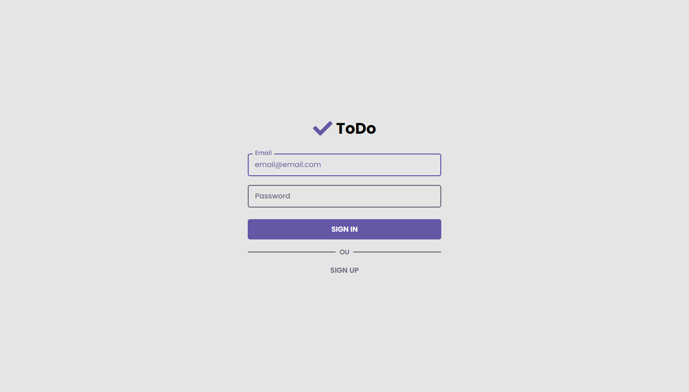
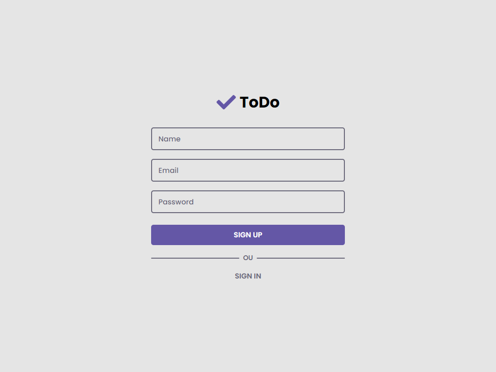
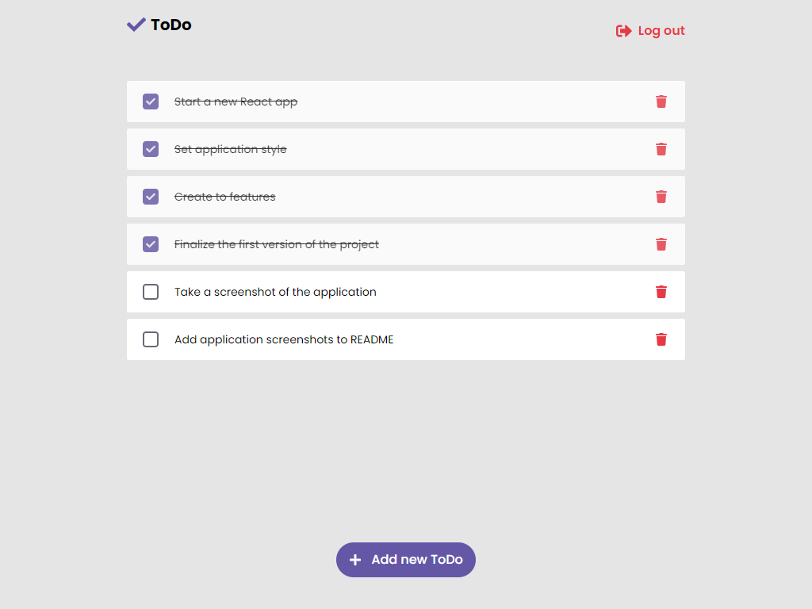
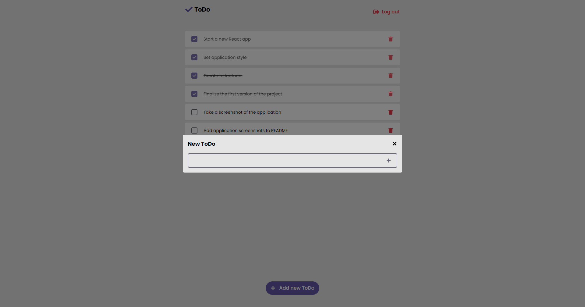
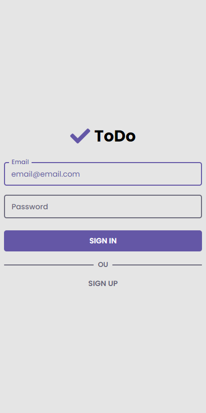
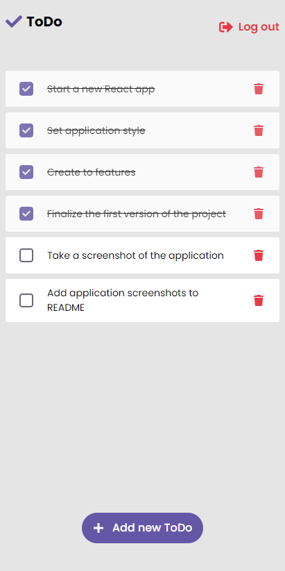
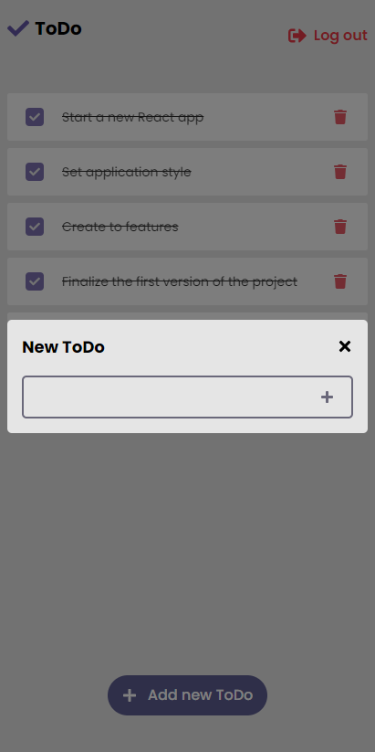

<h1 align="center">
  
</h1>

# ToDo

ToDo é um site de gerenciamento de ToDos feito com React.js + Typescript.

> :warning: Essa aplicação depende da [API Simple ToDo](https://github.com/AlexBorgesDev/api-simple-to-do). A rota da url deve ser alterado no arquivo ./src/services/api.ts.

## Screenshots

* **[WEB](#web)**
* **[MOBILE](#mobile---pixel-2-xl)**

### Web - 1024x768

* **Sign In**  

* **Sign Up**  

* **Browser**  

* **Browser - Modal**  

### Mobile - Pixel 2 XL

* **Sign In**  

* **Browser**  

* **Browser - Modal**  

